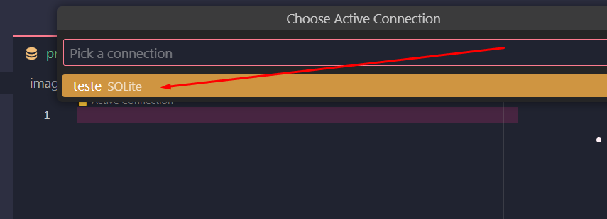
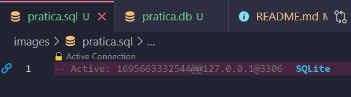
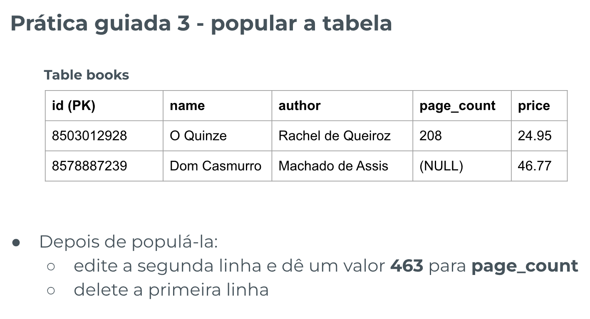
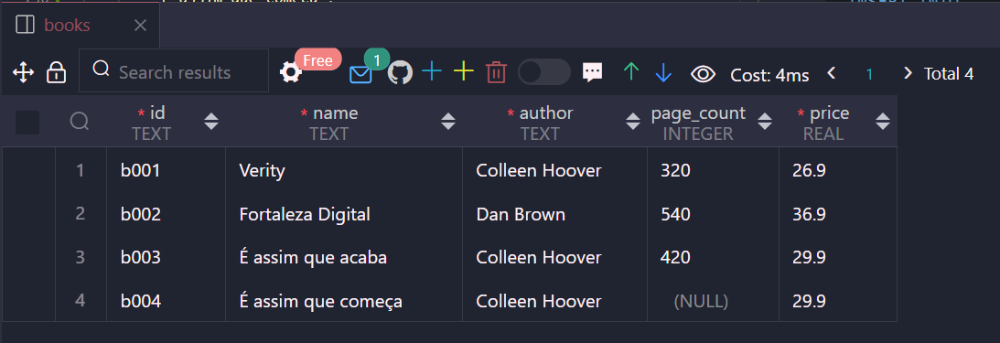

# Introdução a SQL

## Índice

-   [Prática Guiada 1](#prática-guiada-1)

    -   [Enunciado](#enunciado)
    -   [Resolução](#resolução)

-   [Prática Guiada 2](#prática-guiada-2)

    -   [Enunciado](#enunciado-1)
    -   [Resolução](#resoluc3a7c3a3o-1)

-   [Prática Guiada 3](#prática-guiada-3)

    -   [Enunciado](#enunciado-2)
    -   [Resolução](#resoluc3a7c3a3o-2)

-   [Fixação](#fixação)

    -   [Enunciado](#enunciado-3)
    -   [Resolução](#resoluc3a7c3a3o-3)
    -   [Extra](#extra)

## Prática Guiada 1

### Enunciado


### Resolução

Crie uma arquivo `pratica.db`

Conectei a extensão MySQL com o arquivo `pratica.db`:


Crie uma arquivo `pratica.sql` e fiz a conexão:




## Prática Guiada 2

### Enunciado


### Resolução

`pratica.sql`

```sql
-- Criando tabela:
CREATE TABLE
    books (
        id TEXT PRIMARY KEY UNIQUE NOT NULL,
        name TEXT NOT NULL,
        author TEXT NOT NULL,
        page_count INTEGER NOT NULL,
        price REAL NOT NULL
    );

-- Visualizando tabela:
SELECT * FROM books;
-- SELECT name, author FROM books;

-- Apagando tabela
DROP TABLE books;
```

## Prática Guiada 3

### Enunciado



### Resolução

`pratica.sql`

POPULANDO A TABELA

```sql
INSERT INTO
    books (
        id,
        name,
        author,
        page_count,
        price
    )
VALUES (
        'b001',
        'Verity',
        'Colleen Hoover',
        320,
        26.90
    ), (
        'b002',
        'Fortaleza Digital',
        'Dan Brown',
        540,
        36.90
    );
```

```sql
-- Se for inserir todas as infos não precisa dos parênteses:
INSERT INTO books
VALUES (
        'b003',
        'É assim que acaba',
        'Colleen Hoover',
        420,
        29.90
    );
```

```sql
-- Se for deixar de colocar uma informação opcional, não se identifica dentros dos parênteses, nesse caso não tem 'page_count'
INSERT INTO
    books (id, name, author, price)
VALUES (
        'b004',
        'É assim que começa',
        'Colleen Hoover',
        29.90
    );
```

RESULTADO:


EDITANDO A TABELA

```sql
UPDATE books
SET
    price = 30
WHERE id = 'b001';
```

DELETANDO A PRIMEIRA LINHA

```sql
DELETE FROM books WHERE id = 'b001';
```

## Fixação

### Enunciado


### Resolução

```sql
-- FIXAÇÃO --
-- CREATE -> cria uma tabela chamada tasks, com as infos id, curso, description
CREATE TABLE
    tasks (
        id TEXT PRIMARY KEY UNIQUE NOT NULL,
        curso TEXT NOT NULL,
        description TEXT NOT NULL
    );

--READ -> lê toda a tabela tasks
SELECT * FROM tasks;

-- DELETE -> deleta a tabela tasks
DROP TABLE tasks;

-- CREATE -> cria informações na tabela tasks
INSERT INTO
    tasks (id, curso, description)
VALUES ('t001', 'React', 'Props'), ('t002', 'SQL', 'CRUD'), ('t003', 'JS', 'Variáveis');

-- UPDATE -> atualiza informações da linha com is t003 da tabela tasks
UPDATE tasks SET description = 'Arrays' WHERE id = 't003';

-- DELETE -> deleta a linha com id t003 da tabela tasks
DELETE FROM tasks WHERE id = 't003';
```

### EXTRA:

```sql
-- ORDENANDO POR ID
SELECT * FROM tasks ORDER BY id;

-- ORDENANDO POR ORDEM DESCENDENTE
SELECT * FROM tasks ORDER BY curso DESC;
```
